# Modul 5: Java Profiling
## JMeter Report and Test Results
### **Endpoint** `/all-student`
JMeter
Before Optimization Test Result JMeter
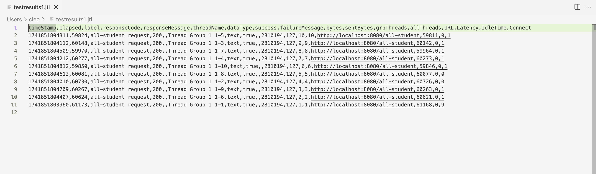
After Optimization Test Result JMeter
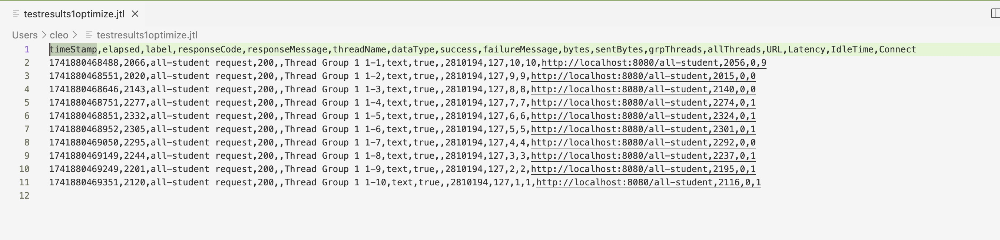
Before Optimization JMeter:
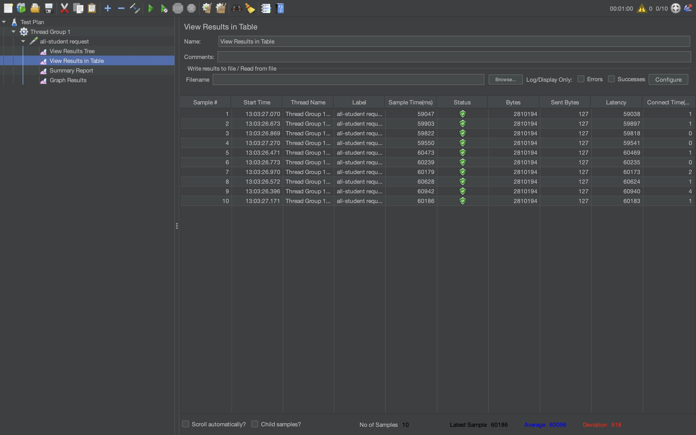
After Optimization JMeter:
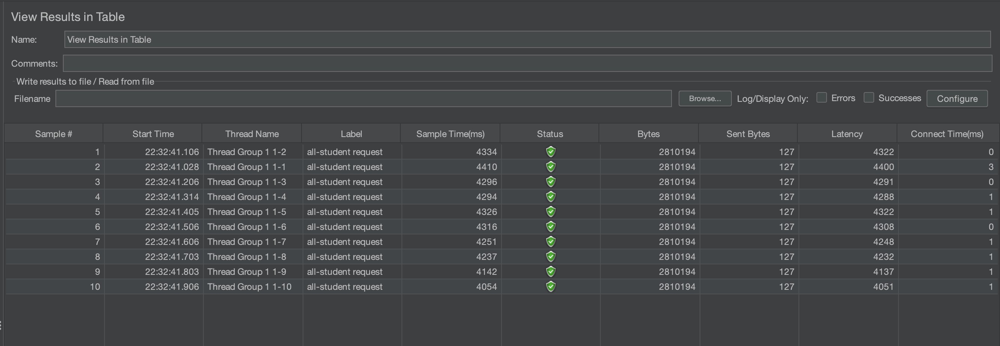

Execution Time `getAllStudentWithCourses()` from Intellij Profiler:

| Before | After  | Diff Percentage |
| -- |--------|-----------------|
| 4526 ms | 680 ms | 85%             |

### **Endpoint** `/all-student-name`
JMeter
Before Optimization Test Result JMeter
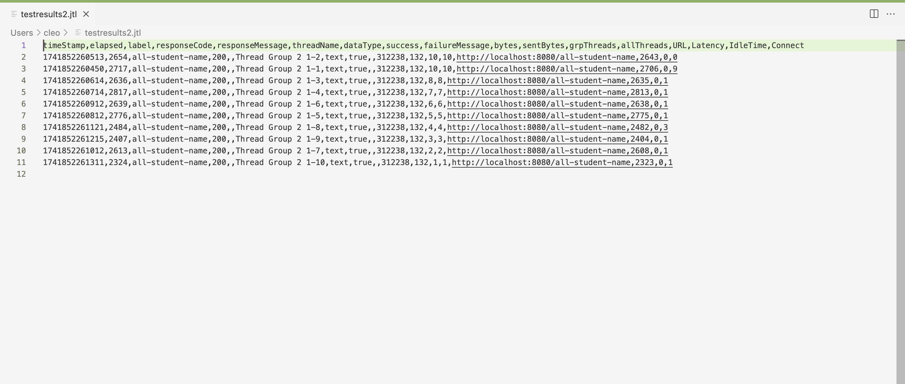
After Optimization Test Result JMeter
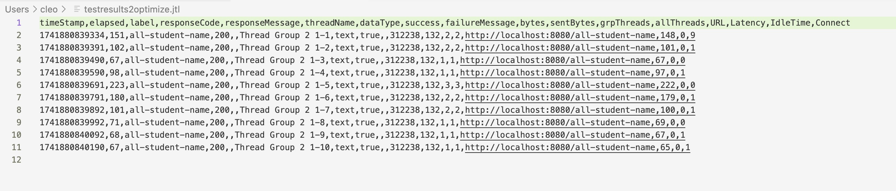
Before Optimization JMeter:
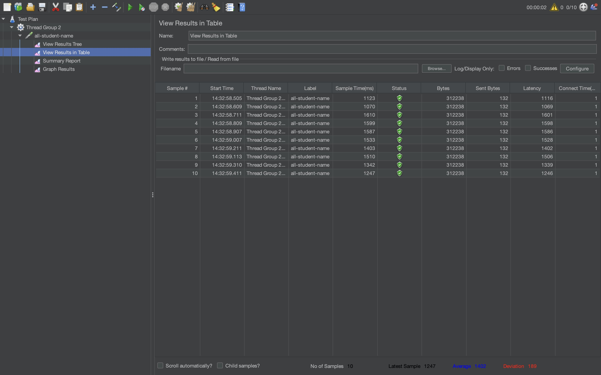
After Optimization JMeter:
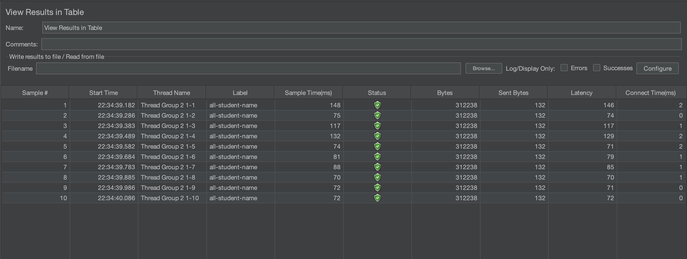

Execution Time `joinStudentNames()` from Intellij Profiler:

| Before | After  | Diff Percentage |
|--------|--------|-----------------|
| 493 ms | 140 ms | 71,6%           |

### **Endpoint** `/highest-gpa`
JMeter
Before Optimization Test Result JMeter
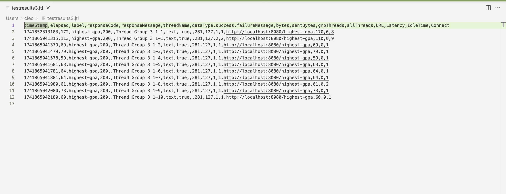
After Optimization Test Result JMeter
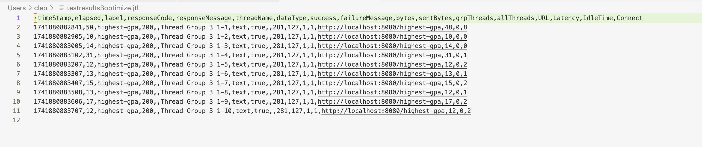
Before Optimization JMeter:
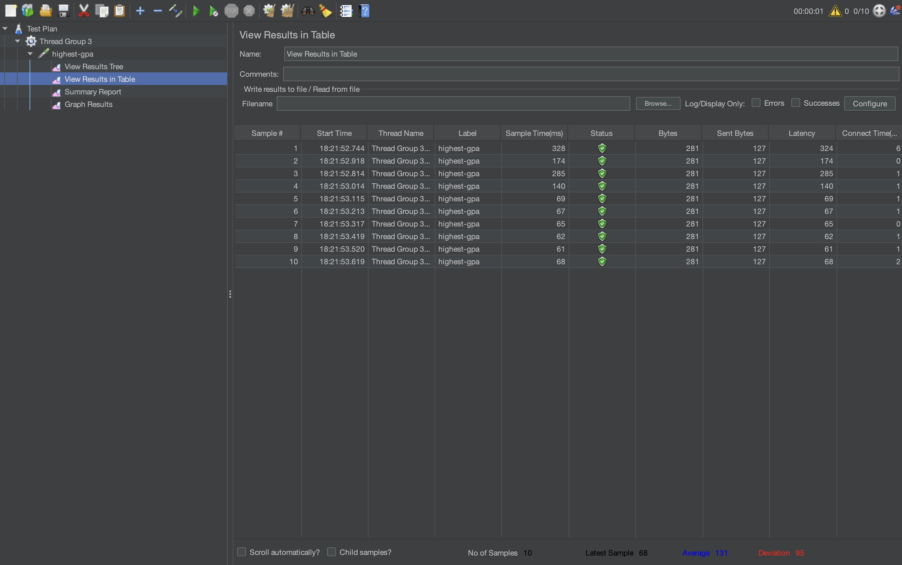
After Optimization JMeter:
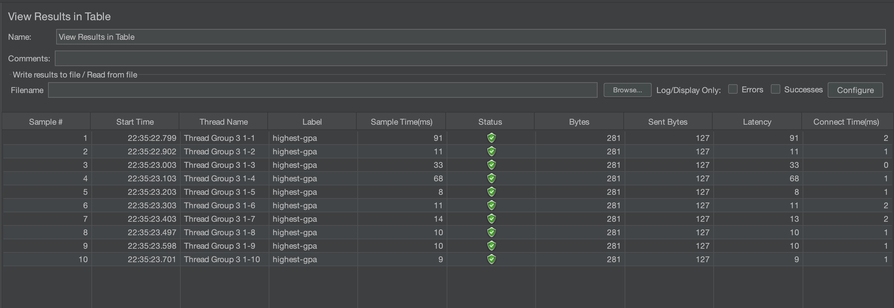

Execution Time `findStudentWithHighestGpa()` from Intellij Profiler:

| Before | After | Diff Percentage |
|--------|-------|-----------------|
| 130 ms | 30 ms | 76,9%           |